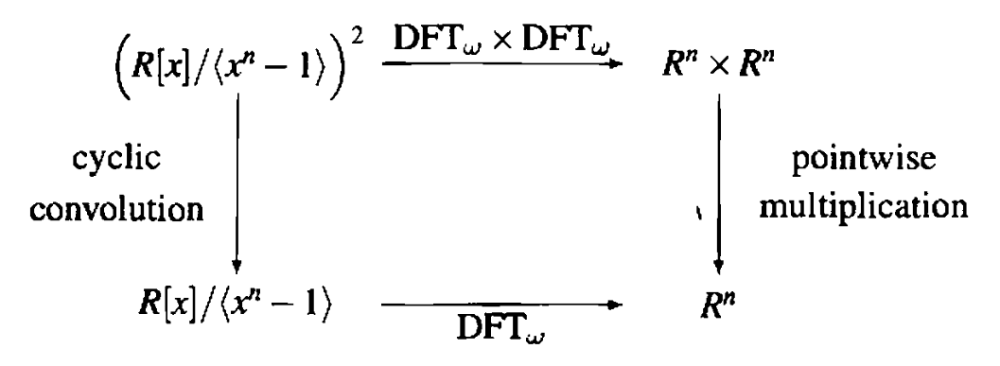

# Implementation of Discrete Fourier Transformation


## 1. How to run

Compile cpp file with the following command:
```bash
$ g++ -O3 -o DFT DFT.cpp
```
You should pass the degree of polynomial as an argument as below:
```bash
$ ./DFT 64
```
The program automatically reads coefficients of polynomials of corresponding degree from `input.txt`. The following commutative diagram, taken from _Modern Computer Algebra: 1st Edition_, illustrates this:

{: width="50%" height="50%"}


## 2. Sample Output

```bash
$ cat input.txt
1 2 3 4 5 6 7 8 9 10 11 12 13 14 15 16
3 -2 7 -4 8 -5 9 -6 1 -15 6 -1 10 -9 7 -2
$ ./DFT
Requires the power of two as an argument. ex) ./DFT 1024
$ ./DFT 16
SFT(1), FFT(2) : 2
( (59) + (1.06581e-14)i ) x^0 + 
( (98) + (2.498e-15)i ) x^1 + 
( (-7) + (-1.38778e-14)i ) x^2 + 
( (64) + (-2.14828e-14)i ) x^3 + 
( (-57) + (-1.35447e-14)i ) x^4 + 
( (30) + (-6.61138e-14)i ) x^5 + 
( (-107) + (-8.75966e-14)i ) x^6 + 
( (-4) + (-1.04527e-13)i ) x^7 + 
( (-13) + (-1.77636e-14)i ) x^8 + 
( (234) + (4.51306e-14)i ) x^9 + 
( ... ) + 
( (100) + (3.09197e-14)i ) x^15

```
